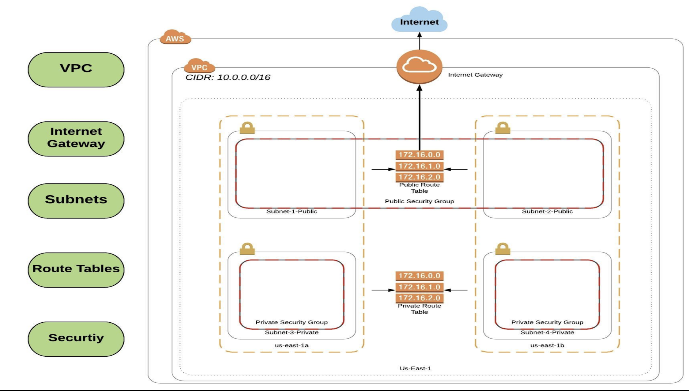

# Virtual Private Cloud 
 
## Description
 This project desribes the architecture and building process of the VPC  step by step.

## Getting Started
 Log in to your AWS account --> https://aws.amazon.com/console/
 Open VPC console --> https://us-east-1.console.aws.amazon.com/vpc/home?region=us-east-1#Home:

## Building new VPC
1. Create VPC 
    * Select Name tag --> Diagram1
    * Select IPv4 CIDR block --> 10.0.0.0/24
    * Select Tenancy --> Default
    * Add tags --> oprional
  
2. Create Internet Gateway and attach it to the created VPC.
    * Select previously created VPC
    * Add tags --> optional
    * Click create Internet gateway
    * After IGW is created, click Actions and attach IGW to the VPC
    * 1 Gateway can be attached to only 1 VPC
  
3. Create 4 subnets - 2 public and 2 private
    * Select subnet names --> eg. Subnet-1-public, Subnet-1-Private
    * Select Availability Zone for each subnet
    * IPv4 CIDR block --> 10.0.1.0/24 (CIDR block cannot be the same for different subnets)
    * Add tags --> optional
  
4. Create public Route Table 
    * Select name --> public-RT
    * Select VPC
    * Add tags  --> optional
    * After RT is created, click Edit routes and add new route with Destination - 0.0.0.0/0 and Target - Internet Gateway 

5. Configure Subnet Associations for public RT
    * Within public-RT select Subnet associations tab and click on edit Subnet associations
    * Select previously created public subnets from the list and save

6. Create private Route Table 
    * Select name --> private-RT
    * Select VPC
    * Add tags  --> optional

7. Configure Subnet Associations for private RT
    * Within private-RT select Subnet associations tab and click on edit Subnet associations
    * Select previously created private subnets from the list and save

8. Create public NACL for security of VPC
    * Select name --> Public-NACL
    * Select VPC
    * Add tags --> optional

9. Configure public NACL 
    * Add Inbound rules
    * Select rule number --> lower number is higner priority
    * Select type --> HTTP(80), SSH(22)
    * Select Source --> 0.0.0.0/0
    * Select Allow and save rules
    * Add Outbound rules
    * Select rule number --> lower number is higner priority
    * Select type --> HTTP(80), SSH(22)
    * Select Source --> 0.0.0.0/0
    * Select Allow and save rules
    * Within public-NACL select Subnet associations tab and click on edit Subnet associations
    * Select previously created public subnets from the list and save
  
10. Create private NACL for security of VPC
    * Select name --> Private-NACL
    * Select VPC
    * Add tags --> optional

11. Configure private NACL 
    * Add Inbound rules
    * Select rule number --> lower number is higner priority
    * Select type --> Custom TCP
    * Select port range --> 1024-65535
    * Select Source --> 10.0.0.0/16
    * Select Allow and save rules
    * Add Outbound rules
    * Select rule number --> lower number is higner priority
    * Select type --> HTTP(80), SSH(22)
    * Select Source --> 0.0.0.0/0
    * Select Allow and save rules
    * Within public-NACL select Subnet associations tab and click on edit Subnet associations
    * Select previously created public subnets from the list and save

