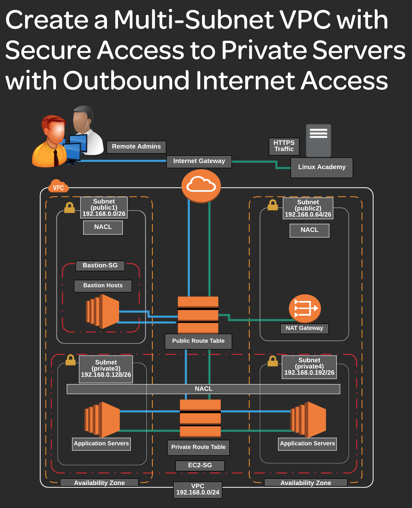

# Virtual Private Cloud 
 
## Description
 This project desribes the architecture and building process of the VPC  step by step.

## Getting Started
 Log in to your AWS account --> https://aws.amazon.com/console/
 Open VPC console --> https://us-east-1.console.aws.amazon.com/vpc/home?region=us-east-1#Home:

## Building new VPC
1. Create VPC 
    * Select Name tag --> Test-VPC
    * Select IPv4 CIDR block --> 192.168.0.0/24
    * Select Tenancy --> Default
    * Add tags --> oprional

2. Create 4 subnets - 2 public and 2 private
    * Select subnet names --> eg. test_public1, test_public2
    * Select Availability Zone for each subnet
    * IPv4 CIDR block --> 192.168.0.0/26 (CIDR block cannot be the same for different subnets)
    * Add tags --> optional

3. Create Internet Gateway and attach it to the created VPC.
    * Select previously created VPC
    * Add tags --> optional
    * Click create Internet gateway
    * After IGW is created, click Actions and attach IGW to the VPC
  
4. Create public Route Table 
    * Select name --> test_publicRT
    * Select VPC
    * Add tags  --> optional
    * After RT is created, click Edit routes and add new route with Destination - 0.0.0.0/0 and Target - Internet Gateway 

5. Configure Subnet Associations for public RT
    * Within test_publicRT select Subnet associations tab and click on edit Subnet associations
    * Select previously created public subnets from the list and save

6. Create private Route Table 
    * Select name --> test_privateRT
    * Select VPC
    * Add tags  --> optional

7. Configure Subnet Associations for private RT
    * Within test_privateRT select Subnet associations tab and click on edit Subnet associations
    * Select previously created private subnets from the list and save

8. Create public NACL for bastion instance security
    * Add inbound rule --> 110 - SSH - 22 - Source my IP/32 
    * Add outbound rule --> 110 - Custom TCP - port range 1024-65535 - Destination my IP/32

9. Create security group for bastion instance
    * Name --> bastion_sg
    * Add inbound rule --> Custom TCP 22 - source myIP/32

10. To test is fo far everything works as expected, launching the EC2 needed
    * Open EC2 console
    * Launch instance --> BastionHost
                          * AMI -> Amazon Linux
                          * Instance type - t2.micro
                          * create new key pair --> download .pem file
                          * Network settings - add our test-vpc
                          * Subnet test_public1
                          * Select existing security group - bastion-sg
    * Open your local bash terminal and run this command --> ssh -i ~/Downloads/bastion.pem ec2-user@ public IP
    Note: Get IP in thr EC2 instance details
        * If connection fails, check the permissions for .pem file
        * chmod 400 ~/Downloads/bastion.pem - gives read only access

11. Create private NACL for Application servers
    * Select name --> test_private1
    * Add inbound and outbound rules
    * 

12. Create private security group for Application server 1
    * Add inbound and outbound rules

13. Launch new EC2 instance for private application server 1
    
14. Provide internet connectivity to the private EC2 instance/ application server
    * Create NAT Gateway
      * name --> test_nat
      * subnet --> test_public2 
      * public

15. Create private NACL for NAT Gateway 
    * Select name --> test_nat_public
    * Add inbound and outbound rules
    * Configure subnet association to test_public2

16. Edit routes for test_privateRT
     * Destination - 0.0.0.0/0
     * Target - NAT Gateway

17. Test connection locally.